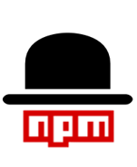

<div align="center">
  <a href="https://github.com/Zerokei/DepGuard">
    
  </a>
  <h3 align="center"> DepGuard </h3>

  <p align="center">
    A tool for exploring npm modules and dependencies.
    <br />
    <br />
    <a href="https://github.com/Zerokei/DepGuard/issue">Report Bug</a>
    ·
    <a href="https://github.com/Zerokei/DepGuard/issue">Request Feature</a>
  </p>
</div>

## About The Project

### Built With

- 

## Getting Started

### Installation

```shell
$ git clone https://github.com/npmgraph/npmgraph.git
$ cd npmgraph
$ npm install
```


## Usage

### Build

This builds the source with Parcel:

```shell
$ npm run build
```

Once built, you can use any dev server to serve the `dist` folder.

### Build and watch

This builds the source and starts an auto-reloading Parcel server:

```shell
$ npm start
```

## License

Distributed under the GPL-3.0 License. See LICENSE.txt for more information.

## Acknowledgments

- [npmgraph](https://github.com/npmgraph/npmgraph): on which our project is based.
- [DependencySniffer](https://github.com/abbasjavan/DependencySniffer): a line tool analyze your Javascript dependencies and notify you of potential dependency smells.
